# Motivation
## Real-world adversarial attacks
* Adversarial patches are widely applied in Computer Vision and Autonomous Driving domain


{width=70%}\
[@Eykholt2018]

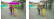{width=50%}\
[@Thys2019]

## State of the art
- Patches are either static or placed on moving objects close to the ground

. . .

- Current adversarial attacks for UAVs do not negatively affect the control

## Can we find adversarial patches and an attacker policy that allows for full control over the victim UAV?

# Flying Adversarial Patches
## Scenario
{width=80%}

## The deep learning model

```{=html}
<video data-autoplay src="videos/clip_frontnet.m4v"></video>
```
PULP-Frontnet [@Palossi2022]


## From pattern and position to policy
::: {.r-stack}
:::: {.fragment .current-visible}
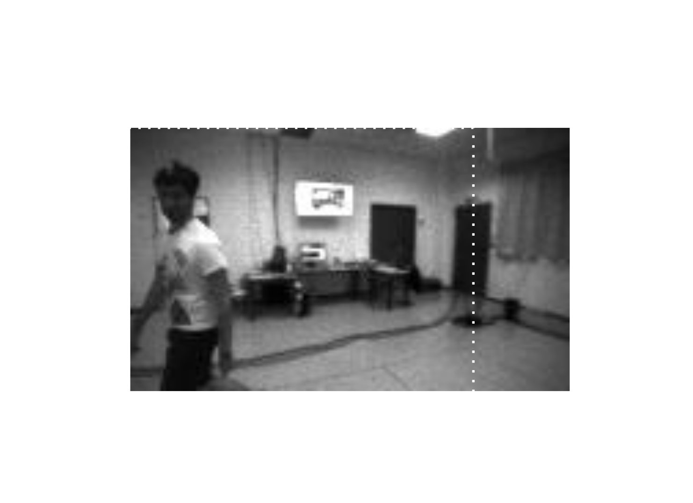{width=80%}
::::
:::: {.fragment .current-visible}
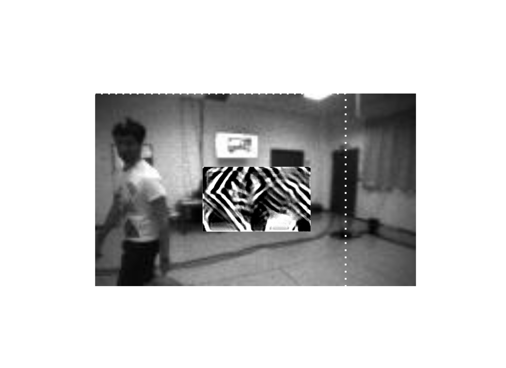{width=80%}
::::
:::: {.fragment .current-visible}
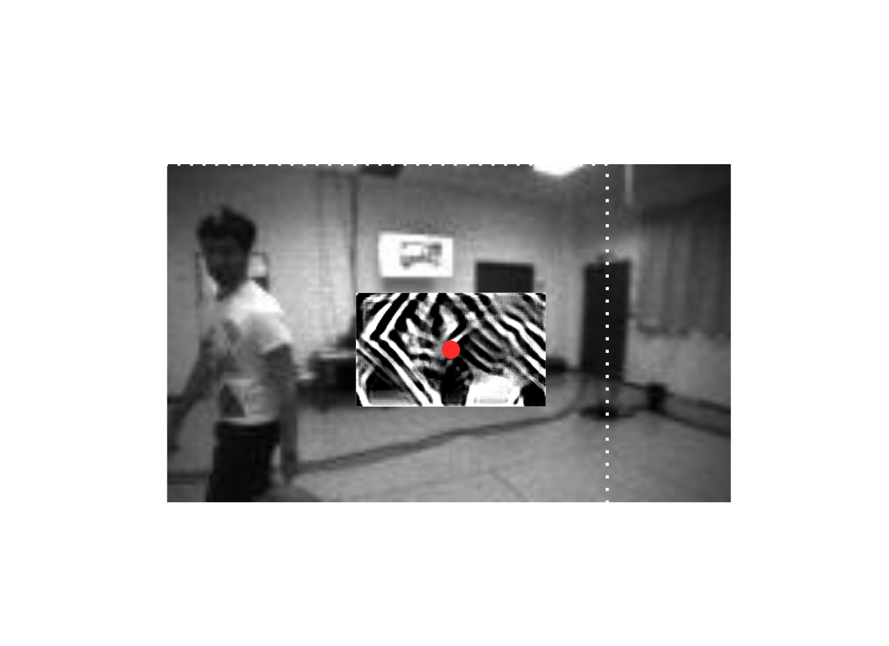{width=80%}
::::
:::: {.fragment .current-visible}
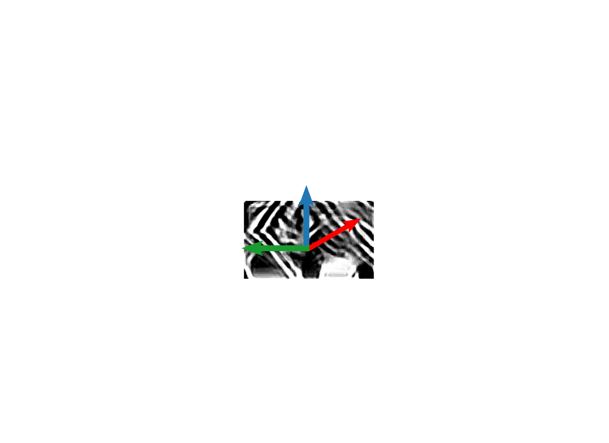{width=80%}
::::
:::: {.fragment .current-visible}
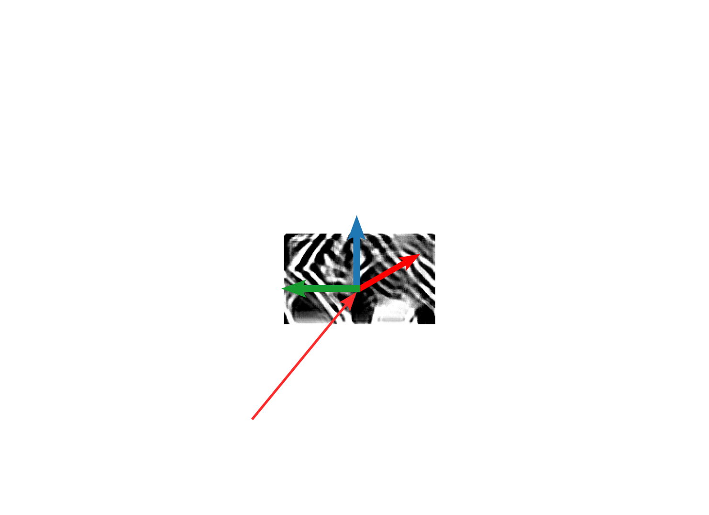{width=80%}
::::
:::: {.fragment .current-visible}
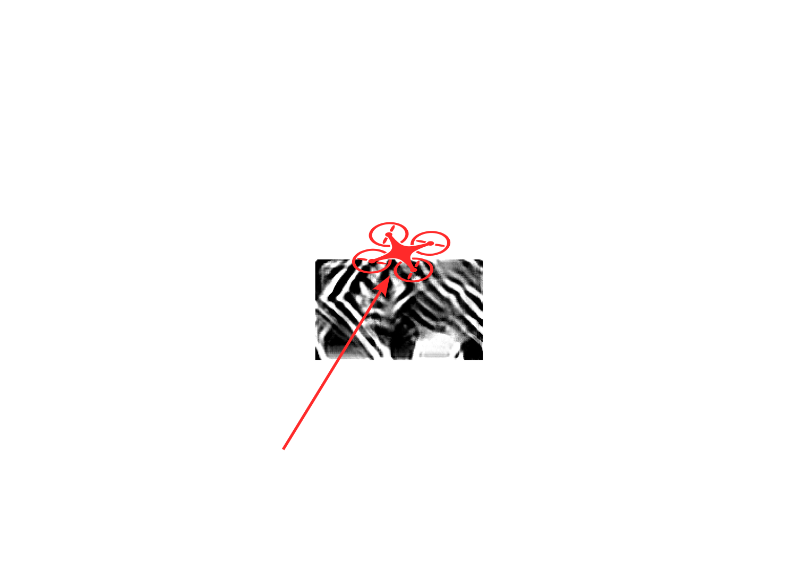{width=80%}
::::
:::

## Optimizing the patches and their positions
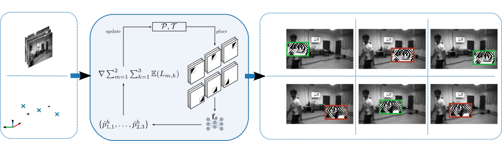{width=100%}

## Target Trajectory
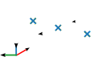

## Assignment
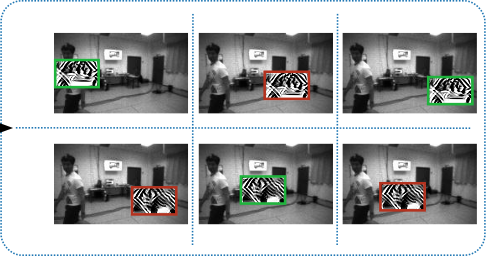

## Optimization
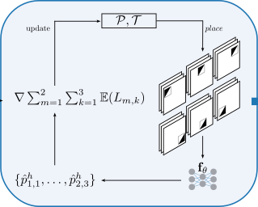{width=65%}

## Optimization
* Compared 3 different optimization algorithms:

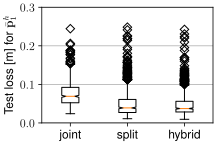{width=49%}
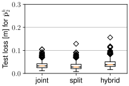{width=49%}

## Optimization
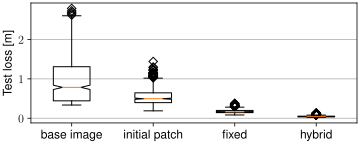{width=100%}

## Scalability
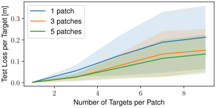{width=100%}


# Real-world experiments
## Attacker and victim
## 
```{=html}
<video data-autoplay src="videos/only_attacker.m4v"></video>
```
## Person, attacker and victim
## 
```{=html}
<video data-autoplay src="videos/attacker_person.m4v"></video>
```
## An actual kidnapping
## 
```{=html}
<video data-autoplay src="videos/attacker_gate.m4v"></video>
```

# Summary
## Contributions
- Adversarial patches that can be placed anywhere in the environment


## Contributions
- Scalable to team of attacker and victims UAVs

{width=80%}

## Contributions
- Attacker policy that is able to force victim onto target trajectory

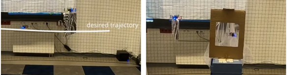


## Questions?
Let's have a chat or send a mail: p.hanfeld@hzdr.de\
{width=30%}

## References
::: {#refs}
:::
